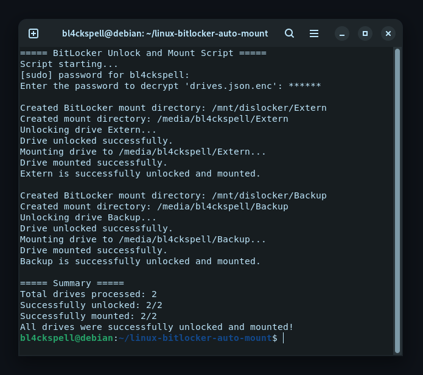

# BitLocker Auto-Mount Script

## Purpose

This script automatically decrypts and mounts BitLocker-encrypted hard drive partitions on Linux.
It is particularly useful for dual-boot systems where Windows partitions are encrypted with BitLocker but need to be accessed from Linux.
The script supports two methods to unlock BitLocker partitions:

- **User password** – The standard BitLocker password used for unlocking the drive.
- **Recovery key** – A 48-digit recovery key, useful if the password is unavailable.

## Setup

### **1. File Setup**

1. **Download and Extract:**

   - Download the script's ZIP file.
   - Extract it and place the folder in a location of your choice.

2. **Update Path:**
   - In [`bitlocker-startup.sh`](./mount-on-startup/bitlocker-startup.sh), replace `SCRIPT_DIRECTORY` with the full path to to the script folder.

### **2. Install Dependencies**

#### **Dislocker (Required to Unlock BitLocker Partitions)**

```bash
sudo apt install dislocker
```

#### **Python Virtual Environment & Required Packages**

To ensure proper package isolation, a Python virtual environment is required.

1. **Create a virtual environment:**

```bash
sudo apt install python3-venv
```

```bash
python3 -m venv /SCRIPT_DIRECTORY/python3-venv
```

2. **Activate the virtual environment:**

```bash
source /SCRIPT_DIRECTORY/python3-venv/bin/activate
```

3. **Install required Python packages:**

```bash
pip install cryptography getpass_asterisk
```

### **3. Configure [`drives.json`](./drives.json)**

Create or edit [`drives.json`](./drives.json) to store your BitLocker partition details.

Each drive entry must include:

- **`NAME`**: A label for the drive (e.g., `"ssd1"`).
- **`PARTUUID`**: The unique identifier of the partition.
- **`PASSWORD`**: Either the **BitLocker password** or **48-digit recovery key**.

#### **How to Find the `PARTUUID` of Your Partition:**

Run the following command:

```bash
lsblk -o NAME,PARTUUID,FSTYPE,MOUNTPOINT
```

### 4. **Encrypt [`drives.json`](./drives.json)**

Once [`drives.json`](./drives.json) is ready, encrypt it for security using [`encrypt.py`](./encrypt.py).

You will be prompted to enter a **password**, which will be required to decrypt the file later.

### 5. **Secure [`drives.json`](./drives.json)**

After encrypting [`drives.json`](./drives.json), delete the unencrypted version to protect your drive passwords.
If you may need to edit the drive information later, store an unencrypted backup on an **encrypted partition**. Only the encrypted _drives.json.enc_ should be kept for regular use.

However, **if your entire Linux system is already encrypted**, keeping the unencrypted [_`drives.json`_](./drives.json) is generally safe.

### 6. **Add the Script to Startup**

To run the script automatically at startup, can either:

1. **Add the startup script to your startup applications manually:**

```bash
/SCRIPT_FOLDER_LOCATION/mount-on-startup/bitlocker-startup.sh
```

2. **Use the included `.desktop` file:**\
   Place the [`bitlocker-unlock-mount.py.desktop`](./mount-on-startup/bitlocker-unlock-mount.py.desktop) file inside `~/.config/autostart/` to automatically launch the script at startup. Before doing so, modify the `Exec` path in the `.desktop` file to point to the correct location of [`bitlocker-startup.sh`](./mount-on-startup/bitlocker-startup.sh).

It is necessary to allow executing the `.sh` file as a program. To do this, run:

```bash
chmod +x /SCRIPT_FOLDER_LOCATION/mount-on-startup/bitlocker-startup.sh
```

## **Manual Execution**

If you want to manually run [`bitlocker-unlock-mount.py`](./bitlocker-unlock-mount.py), follow these steps:

1. **Activate the virtual environment:**

```bash
source /SCRIPT_DIRECTORY/python3-venv/bin/activate
```

2. **Run the script:**

```bash
python /SCRIPT_DIRECTORY/bitlocker-unlock-mount.py
```

## Usage

After logging in, a terminal will automatically open, prompting you to:

1. Enter your user login password for `sudo` permissions.
2. Enter the password that was used to encrypt [`drives.json`](./drives.json).

Once both passwords are entered correctly, the script will decrypt the `drives.json.enc` file and proceed to unlock and mount your BitLocker-encrypted drives.

### **Example Output:**



## Compatibility

This script has been tested on **Ubuntu 22.04** and **Debian 13**.

If you encounter issues:

- Try installing the [dislocker](https://github.com/Aorimn/dislocker) and/or [ntfs-3g](https://github.com/tuxera/ntfs-3g) package manually.

## License

This script is open-source and available under the [MIT License](./LICENSE).
